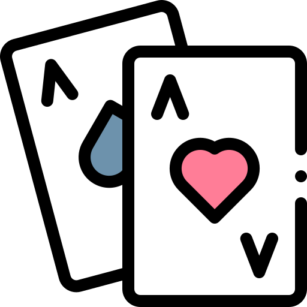

<h1><div id="top"></div></h1>

[![Contributors][contributors-shield]][contributors-url]
[![Forks][forks-shield]][forks-url]
[![Stargazers][stars-shield]][stars-url]
[![Issues][issues-shield]][issues-url]
[![LinkedIn][linkedin-shield]][linkedin-url]

<!-- PROJECT LOGO -->
<br />
<div align="center">
  <a href="https://github.com/llyram/Declare">
    
  </a>

<h3 align="center">Declare</h3>

  <p align="center">
    A realtime multiplayer card game
    <br />
    <a href="https://declare.ga">View Demo</a>
    ·
    <a href="https://github.com/llyram/Declare/issues">Report Bug</a>
    ·
    <a href="https://github.com/llyram/Declare/issues">Request Feature</a>
  </p>
</div>


<!-- TABLE OF CONTENTS -->
<details>
  <summary>Table of Contents</summary>
  <ol>
    <li>
      <a href="#about-the-project">About The Project</a>
      <ul>
        <li><a href="#built-with">Built With</a></li>
      </ul>
    </li>
    <li>
      <a href="#getting-started">Getting Started</a>
      <ul>
        <li><a href="#installation">Installation</a></li>
      </ul>
    </li>
    <li><a href="#Rules">Rules</a></li>
    <li><a href="#contributing">Contributing</a></li>
    <li><a href="#contact">Contact</a></li>
  </ol>
</details>


<!-- ABOUT THE PROJECT -->
## About The Project

![Product Name Screen Shot][product-screenshot]

This is a realtime multiplayer card game. Players can create or join *rooms* to play with other players. see the [rules](#rules) section to see the rules

<p align="right">(<a href="#top">back to top</a>)</p>


### Built With


<p align="right">(<a href="#top">back to top</a>)</p>


<!-- GETTING STARTED -->
## Getting Started

To get a local copy up and running follow these simple example steps.


### Installation

1. Clone the repository:
   ```sh
   git clone https://github.com/llyram/Declare.git
   ```
2. Install npm packages:
   ```sh
   npm install
   ```
3. Start the backend Node server:
   ```sh
   node index.js
   ```
4. Move to the frontend directory, install npm packages and start the React frontend:
   ```sh
   cd frontend
   npm install
   npm start
   ```

<p align="right">(<a href="#top">back to top</a>)</p>

## Rules
1. Each player gets dealt 5 cards.
2. There is one open card placed face up on the board, along with the deck.
3. The immediate objective of the player is to reduce the total value of your hand.
4. One after the other, players play their turn, in which they can throw any single card or pair of cards with the same value.
5. After throwing a card, or a pair of cards, the player **has to** either pick up a card from the deck **OR** pick up the open card, if and only if they have at least one card to pair up the open card with.
6. If the player picks up the open card on their turn, then they **must throw** the pair at their next turn. They cannot declare on their next turn.
7. The round ends when one of the player ***declares*** their hand and two outcomes can occur:
    1. If the total value of the hand of the player who *declared* is less than any of the other players, then the player wins the round and every other player gets the value of their hand added to their total points.
    2. If any of the other players have a total value lower than that of the player who has *declared*, then the declarer is *caught* and they get a penalty of 50 added to their total points.
8. The goal of each round is to reduce the total value of your hand and *declare* if you think your hand is lower than everyone else's. Or wait for someone else to *declare* and see if your hand is lower than theirs.
9. If after any turn a player has only one card left in their hand, and the card is the *Ace* of any suit, then the player **must** declare on their next turn.
10. After the desired number of rounds, the rankings of the players are decided, based on their points on the table. The lower the points the player has, the higher their rank. The player with the lowest total points on the table wins.
11. **Value of each card**: Every number card has the value of the number shown. Ace is 1. Every face card, i.e., King, Queen, and Jack, has a value of 10.

## Contributing

Contributions are what make the open source community such an amazing place to learn, inspire, and create. Any contributions you make are **greatly appreciated**.

If you have a suggestion that would make this better, please fork the repository and create a pull request. You can also simply open an issue with the tag "enhancement".
Don't forget to give the project a star! Thanks again!

1. Fork the Project
2. Create your Feature Branch (`git checkout -b feature/AmazingFeature`)
3. Commit your Changes (`git commit -m 'Add some AmazingFeature'`)
4. Push to the Branch (`git push origin feature/AmazingFeature`)
5. Open a Pull Request

<p align="right">(<a href="#top">back to top</a>)</p>


<!-- CONTACT -->
## Contact

Maryll Castelino - [@maryllcastelino](https://twitter.com/@maryllcastelino) - maryllcastelino@gmail.com

Project Link: [https://github.com/llyram/Declare](https://github.com/llyram/Declare)

<p align="right">(<a href="#top">back to top</a>)</p>


<!-- MARKDOWN LINKS & IMAGES -->
<!-- https://www.markdownguide.org/basic-syntax/#reference-style-links -->
[contributors-shield]: https://img.shields.io/github/contributors/llyram/Declare.svg?style=for-the-badge
[contributors-url]: https://github.com/llyram/Declare/contributors
[forks-shield]: https://img.shields.io/github/forks/llyram/Declare.svg?style=for-the-badge
[forks-url]: https://github.com/llyram/Declare/network/members
[stars-shield]: https://img.shields.io/github/stars/llyram/Declare.svg?style=for-the-badge
[stars-url]: https://github.com/llyram/Declare/stargazers
[issues-shield]: https://img.shields.io/github/issues/llyram/Declare.svg?style=for-the-badge
[issues-url]: https://github.com/llyram/Declare/issues
[linkedin-shield]: https://img.shields.io/badge/-LinkedIn-black.svg?style=for-the-badge&logo=linkedin&colorB=555
[linkedin-url]: https://linkedin.com/in/maryll-castelino-364085192/
[product-screenshot]: images/screenshot.png
[deploy-url]: https://declare-production.up.railway.app/
